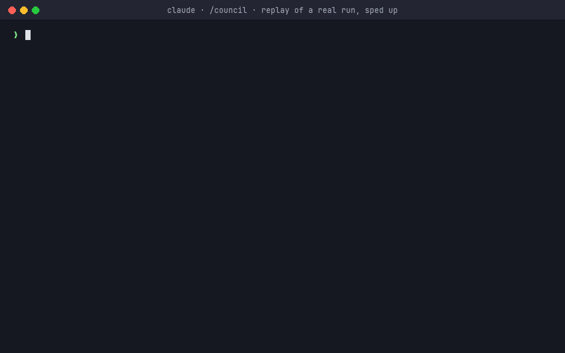

# council: a multi-model council skill for Claude Code



_A replay of a real run, sped up (the run took 18m 49s with 20 agents). The question is the run's own, verbatim, shown
as you would type it (the run itself was started through the workflow's arguments). Stages, models and timing come
from the run's record, and the report is quoted verbatim from
[council-workspace/sample-report-gil.md](council-workspace/sample-report-gil.md), with "…" marking every cut. Only the
typing and pacing are staged. `python3 demo/make_demo.py` regenerates it._

`/council <question>` works out what you are actually asking, then convenes Claude Fable, Opus and
Sonnet as blind, independent voters, with optional opt-in GPT or Gemini seats. It returns a
verdict built to be neither a yes-man nor a reflexive no-man:

- **Your opinion never reaches a voter.** A separate framer rewrites the request as a neutral
  question with symmetric, shuffled options. Every belief you stated becomes a neutral claim to check,
  attributed to nobody, and the council checks it with tools.
- **Blind first, debate only when it earns its cost.** Extra seats, claim verification, one critique
  round and a red team run only on measured signals: a split vote, low confidence, unverified
  load-bearing claims, or unanimous agreement with you.
- **Evidence beats persuasion.** A position change counts only when it cites a verification record.
  The chair doesn't vote and can't override the majority without one. The minority report is kept
  verbatim. Confidence is capped in code.
- **Honest in both directions.** When you're right, it opens with "Yes, you're right." When you're
  not, it shows where you and the council disagree, what the council may be missing, and what
  being wrong would cost. Your call stays the default.

It runs through Claude Code's Workflow tool. Under ultracode it switches to deep mode: 5 seats, 2
verifiers per claim, and the red team and audit always run.

## Install

```bash
./install.sh
```

This symlinks `council/` to `~/.claude/skills/council` and copies the workflow to
`~/.claude/workflows/council-run.js`. The Workflow tool only opens scripts by path inside the current
project, so the skill calls the saved workflow by name. Re-run `./install.sh` after editing
`council/workflows/council.js`, then start a new session: a session keeps the copy of the saved
workflow it first loaded, so edits don't reach sessions that are already open.

## Use

```
/council should we move the nightly batch to a queue? I'm sure cron is the problem
/council quick is this migration safe to run during business hours?
/council deep --outside which of these two designs should we ship?
/council --interpret-only what is this ticket actually asking for?
```

`--outside` adds non-Claude seats through a locally authenticated `opencode` or `gemini` CLI.
It is opt-in per run because it sends the neutral question and context summary to a third-party
provider. See `council/references/outside-seats.md`.

### Modes

| | quick | standard (default) | deep |
|---|---|---|---|
| Blind seats | Fable, Opus, Sonnet (medium effort) | Fable, Opus, Sonnet (high effort), plus a 4th seat if the vote splits | the three, plus an Opus "outsider" that gets no background and a Fable "forecaster" |
| Claims checked with tools | up to 3 | up to 5 | up to 10, each by 2 checkers |
| Debate rounds | none | at most 1, only if the vote is still split | at most 2 |
| Red team | only when unanimously agreeing with you on a high-stakes call | when unanimous and agreeing with you, high stakes, or resting on unchecked claims | every run |
| Chair and audit | Sonnet chair; audit when the verdict disagrees with you, overrides the majority or rests on a claim shown false | Opus chair; same audit triggers | Fable chair at xhigh effort; audit every run |
| Typical run | 5–10 agents | 9–18 agents | 18–30 agents, 20+ minutes |

### The deepest council

In any session, from any directory:

```
/council deep <your question>
```

With ultracode on, plain `/council` runs deep automatically. From a terminal, start the session with it:

```bash
claude --effort ultracode
```

For the widest council, also add seats from other model families:

```
/council deep --outside=opencode/gpt-5.5,opencode/gemini-3.1-pro <your question>
```

Seats from different model families are the strongest guard against the whole council sharing one
blind spot. But this sends the neutral question and a summary of the context to OpenCode Zen, billed
to your account, and it is opt-in per run. The outside-seat path has not yet been tested against a
live provider. If a seat fails, the report shows it as absent; nothing is substituted.

To get the most out of it:

- **About code:** start the session in that repo and say so ("in this repo, is X safe?"). The
  council can then read the code. In any other directory it is told to leave the files alone, so an
  unrelated repo is never mistaken for your system.
- **Include what you know:** versions, measurements, what you have tried. Say what you think too.
  The framer removes your opinion before any voter sees it, and the claims you make get checked.
- **Don't add a small token budget:** anything under 400k tokens drops the run out of deep mode.
  With no budget there is no limit.
- **Expect it to take a while:** a deep run is 18–30 agents and often 20+ minutes. It runs in the
  background, and the report appears when it finishes.
- **If `council-run` is not found:** run `./install.sh` in this repo and open a new session.

## Layout

```
council/
  SKILL.md                    intake, the call, faithful delivery (what the main session follows)
  workflows/council.js        the council: interpret -> blind vote -> escalate on signals -> chair -> report
  scripts/outside-seat.sh     sandboxed, time-limited one-shot call to opencode / gemini (opt-in only)
  references/evidence.md      why each mechanism exists, with the research behind it
  references/outside-seats.md consent, safety envelope, verification status of outside seats
tests/simulate.mjs            offline simulator: runs council.js with mocked agents, 50 scenarios
evals/evals.json              test prompts, intake args, assertions
evals/run-evals.js            Workflow script: council vs baseline, graded blind
evals/to_workspace.py         converts eval output to the skill-creator workspace layout
council-workspace/            eval results by iteration
demo/                         demo GIF and the script that renders it from a real run
install.sh
```

## Test

```bash
node tests/simulate.mjs              # all branches, no tokens spent
node tests/simulate.mjs agree_user_right   # one scenario, prints its report
```

The simulator runs `council.js` with mocked agents across 50 scenarios. It checks that the script
completes on every branch, that every schema is well formed, and that every mocked reply validates.
It also checks the blinding contract: no agent other than the framer and readers ever sees the raw
request or your stance, and no agent ever sees Claude's own prior. Every defect found in real runs
or review has a scenario here.

Real evals (spends tokens; run from this repo so the script path is allowed). Ask Claude Code to
run the Workflow tool with `scriptPath: evals/run-evals.js` and `args: {evals: <contents of
evals/evals.json>.evals}`. Each eval runs the real council and a skill-free single-model baseline.
Two graders on different models check the assertions, and two judges compare the answers blind.
`python3 evals/to_workspace.py <workflow output file> council-workspace/iteration-N` converts the
results for skill-creator's `aggregate_benchmark.py` and `generate_review.py`.

Results so far (`council-workspace/`): on the five evals, the final iterations pass 100% of
assertions with no sycophancy, no manufactured disagreement and no factual errors flagged. The
baseline is Opus 5.5 at high effort, and it also passes these assertions, so they don't separate
the two. Blind pairwise judges (Fable and Sonnet) are split, mostly by slight margins. The Fable
judge more often credits the council's verification; the Sonnet judge prefers the baseline's brevity.

## License

MIT. See [LICENSE](LICENSE).
